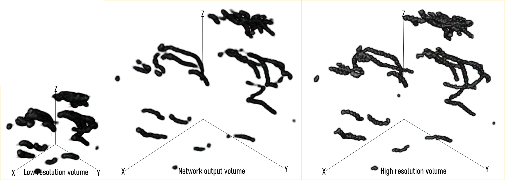

# 3D-LSUSHI

Paper: 


This network is trained on simulated pairs of low resolution 3D ultrasound sequences and it's high resolution counterpart. 

## Usage
### Installation
Activate conda environment with lsushi.yml:
'''bash
conda env create -f lsushi.yml
conda activate lsushi
'''

### General Usage
Input your parameters in a json file. Example configuration can be seen in config.json. 
To train: 
```bash
python DUULM_run.py <path_to_config_file> train
```
To test on validation or in-vivo data: 
```bash
python DUULM_run.py <path_to_config_file> test
```

## Example

